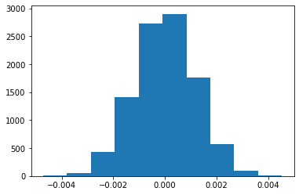

## Analyze A/B Test Results

This project will assure you have mastered the subjects covered in the statistics lessons.  The hope is to have this project be as comprehensive of these topics as possible.  Good luck!

## Table of Contents
- [Introduction](#intro)
- [Part I - Probability](#probability)
- [Part II - A/B Test](#ab_test)
- [Part III - Regression](#regression)


<a id='intro'></a>
### Introduction

A/B tests are very commonly performed by data analysts and data scientists.  It is important that you get some practice working with the difficulties of these 

For this project, you will be working to understand the results of an A/B test run by an e-commerce website.  Your goal is to work through this notebook to help the company understand if they should implement the new page, keep the old page, or perhaps run the experiment longer to make their decision.

**As you work through this notebook, follow along in the classroom and answer the corresponding quiz questions associated with each question.** The labels for each classroom concept are provided for each question.  This will assure you are on the right track as you work through the project, and you can feel more confident in your final submission meeting the criteria.  As a final check, assure you meet all the criteria on the [RUBRIC](https://review.udacity.com/#!/projects/37e27304-ad47-4eb0-a1ab-8c12f60e43d0/rubric).

<a id='probability'></a>
#### Part I - Probability

To get started, let's import our libraries.


```python
import pandas as pd
import numpy as np
import random
import matplotlib.pyplot as plt
%matplotlib inline
#We are setting the seed to assure you get the same answers on quizzes as we set up
random.seed(42)
```

`1.` Now, read in the `ab_data.csv` data. Store it in `df`.  **Use your dataframe to answer the questions in Quiz 1 of the classroom.**

a. Read in the dataset and take a look at the top few rows here:


```python
df=pd.read_csv('ab_data.csv')
df.head(5)
```


<div>
<style scoped>
    .dataframe tbody tr th:only-of-type {
        vertical-align: middle;
    }

    .dataframe tbody tr th {
        vertical-align: top;
    }

    .dataframe thead th {
        text-align: right;
    }
</style>
<table border="1" class="dataframe">
  <thead>
    <tr style="text-align: right;">
      <th></th>
      <th>user_id</th>
      <th>timestamp</th>
      <th>group</th>
      <th>landing_page</th>
      <th>converted</th>
    </tr>
  </thead>
  <tbody>
    <tr>
      <th>0</th>
      <td>851104</td>
      <td>2017-01-21 22:11:48.556739</td>
      <td>control</td>
      <td>old_page</td>
      <td>0</td>
    </tr>
    <tr>
      <th>1</th>
      <td>804228</td>
      <td>2017-01-12 08:01:45.159739</td>
      <td>control</td>
      <td>old_page</td>
      <td>0</td>
    </tr>
    <tr>
      <th>2</th>
      <td>661590</td>
      <td>2017-01-11 16:55:06.154213</td>
      <td>treatment</td>
      <td>new_page</td>
      <td>0</td>
    </tr>
    <tr>
      <th>3</th>
      <td>853541</td>
      <td>2017-01-08 18:28:03.143765</td>
      <td>treatment</td>
      <td>new_page</td>
      <td>0</td>
    </tr>
    <tr>
      <th>4</th>
      <td>864975</td>
      <td>2017-01-21 01:52:26.210827</td>
      <td>control</td>
      <td>old_page</td>
      <td>1</td>
    </tr>
  </tbody>
</table>
</div>


b. Use the below cell to find the number of rows in the dataset.


```python
number_rows=df.shape[0]
number_rows
```


    294478


c. The number of unique users in the dataset.


```python
unique_users=df.user_id.nunique()
unique_users
```


    290584


d. The proportion of users converted.


```python
proportion_users_converted=df.converted.mean()
proportion_users_converted
```


    0.11965919355605512


```python
df[df["converted"]==1].user_id.nunique()
```


    35173


e. The number of times the `new_page` and `treatment` don't line up.


```python
number_new_page_treatment=df.query('(landing_page == "new_page" and group!="treatment") or (landing_page != "new_page" and group=="treatment")' ).shape[0]
number_new_page_treatment
```


    3893


f. Do any of the rows have missing values?


```python
df.info()
```

    <class 'pandas.core.frame.DataFrame'>
    RangeIndex: 294478 entries, 0 to 294477
    Data columns (total 5 columns):
     #   Column        Non-Null Count   Dtype 
    ---  ------        --------------   ----- 
     0   user_id       294478 non-null  int64 
     1   timestamp     294478 non-null  object
     2   group         294478 non-null  object
     3   landing_page  294478 non-null  object
     4   converted     294478 non-null  int64 
    dtypes: int64(2), object(3)
    memory usage: 11.2+ MB
    

`2.` For the rows where **treatment** is not aligned with **new_page** or **control** is not aligned with **old_page**, we cannot be sure if this row truly received the new or old page.  Use **Quiz 2** in the classroom to provide how we should handle these rows.  

a. Now use the answer to the quiz to create a new dataset that meets the specifications from the quiz.  Store your new dataframe in **df2**.


```python
df2=df.query("(group =='treatment'and landing_page=='new_page') or (group =='control'and landing_page=='old_page')")
```


```python
# Double Check all of the correct rows were removed - this should be 0
df2[((df2['group'] == 'treatment') == (df2['landing_page'] == 'new_page')) == False].shape[0]
```


    0


`3.` Use **df2** and the cells below to answer questions for **Quiz3** in the classroom.

a. How many unique **user_id**s are in **df2**?


```python
unique_users_df2=df2.user_id.nunique()
unique_users_df2
```


    290584


```python
df2.head()
```


<div>
<style scoped>
    .dataframe tbody tr th:only-of-type {
        vertical-align: middle;
    }

    .dataframe tbody tr th {
        vertical-align: top;
    }

    .dataframe thead th {
        text-align: right;
    }
</style>
<table border="1" class="dataframe">
  <thead>
    <tr style="text-align: right;">
      <th></th>
      <th>user_id</th>
      <th>timestamp</th>
      <th>group</th>
      <th>landing_page</th>
      <th>converted</th>
    </tr>
  </thead>
  <tbody>
    <tr>
      <th>0</th>
      <td>851104</td>
      <td>2017-01-21 22:11:48.556739</td>
      <td>control</td>
      <td>old_page</td>
      <td>0</td>
    </tr>
    <tr>
      <th>1</th>
      <td>804228</td>
      <td>2017-01-12 08:01:45.159739</td>
      <td>control</td>
      <td>old_page</td>
      <td>0</td>
    </tr>
    <tr>
      <th>2</th>
      <td>661590</td>
      <td>2017-01-11 16:55:06.154213</td>
      <td>treatment</td>
      <td>new_page</td>
      <td>0</td>
    </tr>
    <tr>
      <th>3</th>
      <td>853541</td>
      <td>2017-01-08 18:28:03.143765</td>
      <td>treatment</td>
      <td>new_page</td>
      <td>0</td>
    </tr>
    <tr>
      <th>4</th>
      <td>864975</td>
      <td>2017-01-21 01:52:26.210827</td>
      <td>control</td>
      <td>old_page</td>
      <td>1</td>
    </tr>
  </tbody>
</table>
</div>


b. There is one **user_id** repeated in **df2**.  What is it?


```python
df2[df2['user_id'].duplicated()==True].user_id
```


    2893    773192
    Name: user_id, dtype: int64


c. What is the row information for the repeat user_id?


```python
df2[df2['user_id'].duplicated(keep=False)==True]
```


<div>
<style scoped>
    .dataframe tbody tr th:only-of-type {
        vertical-align: middle;
    }

    .dataframe tbody tr th {
        vertical-align: top;
    }

    .dataframe thead th {
        text-align: right;
    }
</style>
<table border="1" class="dataframe">
  <thead>
    <tr style="text-align: right;">
      <th></th>
      <th>user_id</th>
      <th>timestamp</th>
      <th>group</th>
      <th>landing_page</th>
      <th>converted</th>
    </tr>
  </thead>
  <tbody>
    <tr>
      <th>1899</th>
      <td>773192</td>
      <td>2017-01-09 05:37:58.781806</td>
      <td>treatment</td>
      <td>new_page</td>
      <td>0</td>
    </tr>
    <tr>
      <th>2893</th>
      <td>773192</td>
      <td>2017-01-14 02:55:59.590927</td>
      <td>treatment</td>
      <td>new_page</td>
      <td>0</td>
    </tr>
  </tbody>
</table>
</div>


d. Remove **one** of the rows with a duplicate **user_id**, but keep your dataframe as **df2**.


```python
df2=df2.drop_duplicates(subset='user_id')
df2.shape
```


    (290584, 5)


`4.` Use **df2** in the below cells to answer the quiz questions related to **Quiz 4** in the classroom.

a. What is the probability of an individual converting regardless of the page they receive?


```python
df2['converted'].mean()
```


    0.11959708724499628


b. Given that an individual was in the `control` group, what is the probability they converted?


```python
df2.query('group=="control"')['converted'].mean()
```


    0.1203863045004612


c. Given that an individual was in the `treatment` group, what is the probability they converted?


```python
df2.query('group=="treatment"')['converted'].mean()
```


    0.11880806551510564


d. What is the probability that an individual received the new page?


```python
df2.query('landing_page =="new_page"').shape[0]/df2.shape[0]
```


    0.5000619442226688


e. Consider your results from a. through d. above, and explain below whether you think there is sufficient evidence to say that the new treatment page leads to more conversions.

**from the above data we have no sufficient evidance as tretment and control have almost the same value 11.9 and 12 % and individual probability who receive the new page is just 0.5 ,so we have no evidance that using either page will lead to more converision.**

<a id='ab_test'></a>
### Part II - A/B Test

Notice that because of the time stamp associated with each event, you could technically run a hypothesis test continuously as each observation was observed.  

However, then the hard question is do you stop as soon as one page is considered significantly better than another or does it need to happen consistently for a certain amount of time?  How long do you run to render a decision that neither page is better than another?  

These questions are the difficult parts associated with A/B tests in general.  


`1.` For now, consider you need to make the decision just based on all the data provided.  If you want to assume that the old page is better unless the new page proves to be definitely better at a Type I error rate of 5%, what should your null and alternative hypotheses be?  You can state your hypothesis in terms of words or in terms of **$p_{old}$** and **$p_{new}$**, which are the converted rates for the old and new pages.

**$$ H_0:P_{new}-P_{old}<= 0 $$
$$ H_1:P_{new}-P_{old}>0 $$**

`2.` Assume under the null hypothesis, $p_{new}$ and $p_{old}$ both have "true" success rates equal to the **converted** success rate regardless of page - that is $p_{new}$ and $p_{old}$ are equal. Furthermore, assume they are equal to the **converted** rate in **ab_data.csv** regardless of the page. <br><br>

Use a sample size for each page equal to the ones in **ab_data.csv**.  <br><br>

Perform the sampling distribution for the difference in **converted** between the two pages over 10,000 iterations of calculating an estimate from the null.  <br><br>

Use the cells below to provide the necessary parts of this simulation.  If this doesn't make complete sense right now, don't worry - you are going to work through the problems below to complete this problem.  You can use **Quiz 5** in the classroom to make sure you are on the right track.<br><br>

a. What is the **convert rate** for $p_{new}$ under the null? 


```python
convert_rate_Pnew=df2.converted.mean()
convert_rate_Pnew
```


    0.11959708724499628


b. What is the **convert rate** for $p_{old}$ under the null? <br><br>


```python
convert_rate_Pold=df2.converted.mean()
convert_rate_Pold
```


    0.11959708724499628


c. What is $n_{new}$?


```python
n_new=df2.query('landing_page == "new_page"').shape[0]
n_new
```


    145310


d. What is $n_{old}$?


```python
n_old=df2.query('landing_page == "old_page"').shape[0]
n_old
```


    145274


e. Simulate $n_{new}$ transactions with a convert rate of $p_{new}$ under the null.  Store these $n_{new}$ 1's and 0's in **new_page_converted**.


```python
new_page_converted = np.random.binomial(1, convert_rate_Pnew, n_new)
new_page_converted=new_page_converted.mean()
new_page_converted
```


    0.12039777028421994


f. Simulate $n_{old}$ transactions with a convert rate of $p_{old}$ under the null.  Store these $n_{old}$ 1's and 0's in **old_page_converted**.


```python
old_page_converted = np.random.binomial(1, convert_rate_Pold, n_old)
old_page_converted=old_page_converted.mean()
old_page_converted
```


    0.12126051461376433


g. Find $p_{new}$ - $p_{old}$ for your simulated values from part (e) and (f).


```python
new_page_converted-old_page_converted
```


    -0.0008627443295443904


h. Simulate 10,000 $p_{new}$ - $p_{old}$ values using this same process similarly to the one you calculated in parts **a. through g.** above.  Store all 10,000 values in a numpy array called **p_diffs**.


```python
#10000 
new_converted_simulation = np.random.binomial(n_new, convert_rate_Pnew, 10000)/n_new
old_converted_simulation = np.random.binomial(n_old, convert_rate_Pold, 10000)/n_old
p_diffs = new_converted_simulation - old_converted_simulation
```

i. Plot a histogram of the **p_diffs**.  Does this plot look like what you expected?  Use the matching problem in the classroom to assure you fully understand what was computed here.


```python
plt.hist(p_diffs);
```





j. What proportion of the **p_diffs** are greater than the actual difference observed in **ab_data.csv**?


```python
obs_diff = df2.query('group=="treatment"')['converted'].mean() - df2.query('group=="control"')['converted'].mean()
obs_diff
```


    -0.0015782389853555567


```python
plt.hist(p_diffs);
plt.axvline(x=obs_diff, color='red');
```


```python
#proportion of the p_diffs are greater than the actual difference observed in ab_data.csv
(p_diffs > obs_diff).mean()
```


    0.9023


k. In words, explain what you just computed in part **j.**  What is this value called in scientific studies?  What does this value mean in terms of whether or not there is a difference between the new and old pages?

**As the p-value(0.9023) larger than alpha(0.5) we cannot reject the null hypothesis. which mean old_page is better than or equall new_page.**

l. We could also use a built-in to achieve similar results.  Though using the built-in might be easier to code, the above portions are a walkthrough of the ideas that are critical to correctly thinking about statistical significance. Fill in the below to calculate the number of conversions for each page, as well as the number of individuals who received each page. Let `n_old` and `n_new` refer the the number of rows associated with the old page and new pages, respectively.


```python
df2.head(3)
```


<div>
<style scoped>
    .dataframe tbody tr th:only-of-type {
        vertical-align: middle;
    }

    .dataframe tbody tr th {
        vertical-align: top;
    }

    .dataframe thead th {
        text-align: right;
    }
</style>
<table border="1" class="dataframe">
  <thead>
    <tr style="text-align: right;">
      <th></th>
      <th>user_id</th>
      <th>timestamp</th>
      <th>group</th>
      <th>landing_page</th>
      <th>converted</th>
    </tr>
  </thead>
  <tbody>
    <tr>
      <th>0</th>
      <td>851104</td>
      <td>2017-01-21 22:11:48.556739</td>
      <td>control</td>
      <td>old_page</td>
      <td>0</td>
    </tr>
    <tr>
      <th>1</th>
      <td>804228</td>
      <td>2017-01-12 08:01:45.159739</td>
      <td>control</td>
      <td>old_page</td>
      <td>0</td>
    </tr>
    <tr>
      <th>2</th>
      <td>661590</td>
      <td>2017-01-11 16:55:06.154213</td>
      <td>treatment</td>
      <td>new_page</td>
      <td>0</td>
    </tr>
  </tbody>
</table>
</div>


```python
import statsmodels.api as sm

convert_old =df2.query('landing_page=="old_page" and converted==1').shape[0]
convert_new = df2.query('landing_page=="new_page" and converted==1').shape[0]
n_old = df2.query('landing_page=="old_page"').shape[0]
n_new = df2.query('landing_page=="new_page"').shape[0]
```

m. Now use `stats.proportions_ztest` to compute your test statistic and p-value.  [Here](http://knowledgetack.com/python/statsmodels/proportions_ztest/) is a helpful link on using the built in.


```python
stat, pval = sm.stats.proportions_ztest([convert_old,convert_new], [n_old,n_new],alternative = 'smaller')
print('statistics = ',stat,' p-value = ',pval)
```

    statistics =  1.3109241984234394  p-value =  0.9050583127590245
    


```python
z_score, pval = sm.stats.proportions_ztest([convert_old,convert_new], [n_old,n_new],alternative = 'larger')
print('z_score = ',stat,' p-value = ',pval)
```

    z_score =  1.3109241984234394  p-value =  0.09494168724097551
    

n. What do the z-score and p-value you computed in the previous question mean for the conversion rates of the old and new pages?  Do they agree with the findings in parts **j.** and **k.**?


```python

from scipy.stats import norm

print(norm.cdf(z_score))
# Tells us how significant our z-score is

# for our single-sides test, assumed at 95% confidence level, we calculate: 
print(norm.ppf(1-(0.05)))
# Tells us what our critical value at 95% confidence is 
# Here, we take the 95% values as specified in PartII.1
```

    0.9050583127590245
    1.6448536269514722
    

**z-score is less than critical value 1.644 and P-value=0.0905 obtained is similar to the result obtained from  above in j. and k. which also fails to reject the null hypothesis**

<a id='regression'></a>
### Part III - A regression approach

`1.` In this final part, you will see that the result you acheived in the previous A/B test can also be acheived by performing regression.<br><br>

a. Since each row is either a conversion or no conversion, what type of regression should you be performing in this case?

**Logistic Regression.**


```python
df2.head(2)
```


<div>
<style scoped>
    .dataframe tbody tr th:only-of-type {
        vertical-align: middle;
    }

    .dataframe tbody tr th {
        vertical-align: top;
    }

    .dataframe thead th {
        text-align: right;
    }
</style>
<table border="1" class="dataframe">
  <thead>
    <tr style="text-align: right;">
      <th></th>
      <th>user_id</th>
      <th>timestamp</th>
      <th>group</th>
      <th>landing_page</th>
      <th>converted</th>
    </tr>
  </thead>
  <tbody>
    <tr>
      <th>0</th>
      <td>851104</td>
      <td>2017-01-21 22:11:48.556739</td>
      <td>control</td>
      <td>old_page</td>
      <td>0</td>
    </tr>
    <tr>
      <th>1</th>
      <td>804228</td>
      <td>2017-01-12 08:01:45.159739</td>
      <td>control</td>
      <td>old_page</td>
      <td>0</td>
    </tr>
  </tbody>
</table>
</div>


b. The goal is to use **statsmodels** to fit the regression model you specified in part **a.** to see if there is a significant difference in conversion based on which page a customer receives.  However, you first need to create a column for the intercept, and create a dummy variable column for which page each user received.  Add an **intercept** column, as well as an **ab_page** column, which is 1 when an individual receives the **treatment** and 0 if **control**.


```python
df2['intercept']=1

df2[['group1','ab_page']]=pd.get_dummies(df2[['group']])
df2.drop(labels=['group1'], axis=1, inplace=True)
df2.head(2)
```


<div>
<style scoped>
    .dataframe tbody tr th:only-of-type {
        vertical-align: middle;
    }

    .dataframe tbody tr th {
        vertical-align: top;
    }

    .dataframe thead th {
        text-align: right;
    }
</style>
<table border="1" class="dataframe">
  <thead>
    <tr style="text-align: right;">
      <th></th>
      <th>user_id</th>
      <th>timestamp</th>
      <th>group</th>
      <th>landing_page</th>
      <th>converted</th>
      <th>intercept</th>
      <th>ab_page</th>
    </tr>
  </thead>
  <tbody>
    <tr>
      <th>0</th>
      <td>851104</td>
      <td>2017-01-21 22:11:48.556739</td>
      <td>control</td>
      <td>old_page</td>
      <td>0</td>
      <td>1</td>
      <td>0</td>
    </tr>
    <tr>
      <th>1</th>
      <td>804228</td>
      <td>2017-01-12 08:01:45.159739</td>
      <td>control</td>
      <td>old_page</td>
      <td>0</td>
      <td>1</td>
      <td>0</td>
    </tr>
  </tbody>
</table>
</div>


c. Use **statsmodels** to import your regression model.  Instantiate the model, and fit the model using the two columns you created in part **b.** to predict whether or not an individual converts.


```python
log_mod = sm.Logit(df2['converted'], df2[['intercept', 'ab_page']])
results = log_mod.fit()
```

    Optimization terminated successfully.
             Current function value: 0.366118
             Iterations 6
    

d. Provide the summary of your model below, and use it as necessary to answer the following questions.


```python
results.summary()
```


<table class="simpletable">
<caption>Logit Regression Results</caption>
<tr>
  <th>Dep. Variable:</th>       <td>converted</td>    <th>  No. Observations:  </th>   <td>290584</td>   
</tr>
<tr>
  <th>Model:</th>                 <td>Logit</td>      <th>  Df Residuals:      </th>   <td>290582</td>   
</tr>
<tr>
  <th>Method:</th>                 <td>MLE</td>       <th>  Df Model:          </th>   <td>     1</td>   
</tr>
<tr>
  <th>Date:</th>            <td>Tue, 23 Feb 2021</td> <th>  Pseudo R-squ.:     </th>  <td>8.077e-06</td> 
</tr>
<tr>
  <th>Time:</th>                <td>20:24:17</td>     <th>  Log-Likelihood:    </th> <td>-1.0639e+05</td>
</tr>
<tr>
  <th>converged:</th>             <td>True</td>       <th>  LL-Null:           </th> <td>-1.0639e+05</td>
</tr>
<tr>
  <th>Covariance Type:</th>     <td>nonrobust</td>    <th>  LLR p-value:       </th>   <td>0.1899</td>   
</tr>
</table>
<table class="simpletable">
<tr>
      <td></td>         <th>coef</th>     <th>std err</th>      <th>z</th>      <th>P>|z|</th>  <th>[0.025</th>    <th>0.975]</th>  
</tr>
<tr>
  <th>intercept</th> <td>   -1.9888</td> <td>    0.008</td> <td> -246.669</td> <td> 0.000</td> <td>   -2.005</td> <td>   -1.973</td>
</tr>
<tr>
  <th>ab_page</th>   <td>   -0.0150</td> <td>    0.011</td> <td>   -1.311</td> <td> 0.190</td> <td>   -0.037</td> <td>    0.007</td>
</tr>
</table>


e. What is the p-value associated with **ab_page**? Why does it differ from the value you found in **Part II**?<br><br>  **Hint**: What are the null and alternative hypotheses associated with your regression model, and how do they compare to the null and alternative hypotheses in the **Part II**?

**The P-value is 0.19 is lower than 0.9 in earlier,that could be because of the null and alternative in first case is
$$ H_0:P_{new}-P_{old}<= 0 $$
$$ H_1:P_{new}-P_{old}>0 $$
and in second case about  
$$ H_0:P_{new} = P_{old}$$
$$ H_1:P_{new} \neq P_{old} $$ 
.**

f. Now, you are considering other things that might influence whether or not an individual converts.  Discuss why it is a good idea to consider other factors to add into your regression model.  Are there any disadvantages to adding additional terms into your regression model?


> **Adding new factors make results more reliable and can improve R-square value.**
>
> **Identify outliers if exist**
>
> **we have too ensure when adding new factors the relation between them and there is no multicolinearity**
>
> **adding new factors mean data sure need cleaning**


g. Now along with testing if the conversion rate changes for different pages, also add an effect based on which country a user lives. You will need to read in the **countries.csv** dataset and merge together your datasets on the approporiate rows.  [Here](https://pandas.pydata.org/pandas-docs/stable/generated/pandas.DataFrame.join.html) are the docs for joining tables. 

Does it appear that country had an impact on conversion?  Don't forget to create dummy variables for these country columns - **Hint: You will need two columns for the three dummy variables.** Provide the statistical output as well as a written response to answer this question.


```python
df2.head()
```


<div>
<style scoped>
    .dataframe tbody tr th:only-of-type {
        vertical-align: middle;
    }

    .dataframe tbody tr th {
        vertical-align: top;
    }

    .dataframe thead th {
        text-align: right;
    }
</style>
<table border="1" class="dataframe">
  <thead>
    <tr style="text-align: right;">
      <th></th>
      <th>user_id</th>
      <th>timestamp</th>
      <th>group</th>
      <th>landing_page</th>
      <th>converted</th>
      <th>intercept</th>
      <th>ab_page</th>
    </tr>
  </thead>
  <tbody>
    <tr>
      <th>0</th>
      <td>851104</td>
      <td>2017-01-21 22:11:48.556739</td>
      <td>control</td>
      <td>old_page</td>
      <td>0</td>
      <td>1</td>
      <td>0</td>
    </tr>
    <tr>
      <th>1</th>
      <td>804228</td>
      <td>2017-01-12 08:01:45.159739</td>
      <td>control</td>
      <td>old_page</td>
      <td>0</td>
      <td>1</td>
      <td>0</td>
    </tr>
    <tr>
      <th>2</th>
      <td>661590</td>
      <td>2017-01-11 16:55:06.154213</td>
      <td>treatment</td>
      <td>new_page</td>
      <td>0</td>
      <td>1</td>
      <td>1</td>
    </tr>
    <tr>
      <th>3</th>
      <td>853541</td>
      <td>2017-01-08 18:28:03.143765</td>
      <td>treatment</td>
      <td>new_page</td>
      <td>0</td>
      <td>1</td>
      <td>1</td>
    </tr>
    <tr>
      <th>4</th>
      <td>864975</td>
      <td>2017-01-21 01:52:26.210827</td>
      <td>control</td>
      <td>old_page</td>
      <td>1</td>
      <td>1</td>
      <td>0</td>
    </tr>
  </tbody>
</table>
</div>


```python
countries_df = pd.read_csv('./countries.csv')
df_new = countries_df.set_index('user_id').join(df2.set_index('user_id'), how='inner')
```


```python
df_new.head()
```


<div>
<style scoped>
    .dataframe tbody tr th:only-of-type {
        vertical-align: middle;
    }

    .dataframe tbody tr th {
        vertical-align: top;
    }

    .dataframe thead th {
        text-align: right;
    }
</style>
<table border="1" class="dataframe">
  <thead>
    <tr style="text-align: right;">
      <th></th>
      <th>country</th>
      <th>timestamp</th>
      <th>group</th>
      <th>landing_page</th>
      <th>converted</th>
      <th>intercept</th>
      <th>ab_page</th>
    </tr>
    <tr>
      <th>user_id</th>
      <th></th>
      <th></th>
      <th></th>
      <th></th>
      <th></th>
      <th></th>
      <th></th>
    </tr>
  </thead>
  <tbody>
    <tr>
      <th>834778</th>
      <td>UK</td>
      <td>2017-01-14 23:08:43.304998</td>
      <td>control</td>
      <td>old_page</td>
      <td>0</td>
      <td>1</td>
      <td>0</td>
    </tr>
    <tr>
      <th>928468</th>
      <td>US</td>
      <td>2017-01-23 14:44:16.387854</td>
      <td>treatment</td>
      <td>new_page</td>
      <td>0</td>
      <td>1</td>
      <td>1</td>
    </tr>
    <tr>
      <th>822059</th>
      <td>UK</td>
      <td>2017-01-16 14:04:14.719771</td>
      <td>treatment</td>
      <td>new_page</td>
      <td>1</td>
      <td>1</td>
      <td>1</td>
    </tr>
    <tr>
      <th>711597</th>
      <td>UK</td>
      <td>2017-01-22 03:14:24.763511</td>
      <td>control</td>
      <td>old_page</td>
      <td>0</td>
      <td>1</td>
      <td>0</td>
    </tr>
    <tr>
      <th>710616</th>
      <td>UK</td>
      <td>2017-01-16 13:14:44.000513</td>
      <td>treatment</td>
      <td>new_page</td>
      <td>0</td>
      <td>1</td>
      <td>1</td>
    </tr>
  </tbody>
</table>
</div>


```python
df_new['country'].value_counts()#there are 3 values
```


    US    203619
    UK     72466
    CA     14499
    Name: country, dtype: int64


```python
### Create the necessary dummy variables
df_new[['UK','US']]=pd.get_dummies(df_new['country'])[['UK','US']]
df_new.head()
```


<div>
<style scoped>
    .dataframe tbody tr th:only-of-type {
        vertical-align: middle;
    }

    .dataframe tbody tr th {
        vertical-align: top;
    }

    .dataframe thead th {
        text-align: right;
    }
</style>
<table border="1" class="dataframe">
  <thead>
    <tr style="text-align: right;">
      <th></th>
      <th>country</th>
      <th>timestamp</th>
      <th>group</th>
      <th>landing_page</th>
      <th>converted</th>
      <th>intercept</th>
      <th>ab_page</th>
      <th>UK</th>
      <th>US</th>
    </tr>
    <tr>
      <th>user_id</th>
      <th></th>
      <th></th>
      <th></th>
      <th></th>
      <th></th>
      <th></th>
      <th></th>
      <th></th>
      <th></th>
    </tr>
  </thead>
  <tbody>
    <tr>
      <th>834778</th>
      <td>UK</td>
      <td>2017-01-14 23:08:43.304998</td>
      <td>control</td>
      <td>old_page</td>
      <td>0</td>
      <td>1</td>
      <td>0</td>
      <td>1</td>
      <td>0</td>
    </tr>
    <tr>
      <th>928468</th>
      <td>US</td>
      <td>2017-01-23 14:44:16.387854</td>
      <td>treatment</td>
      <td>new_page</td>
      <td>0</td>
      <td>1</td>
      <td>1</td>
      <td>0</td>
      <td>1</td>
    </tr>
    <tr>
      <th>822059</th>
      <td>UK</td>
      <td>2017-01-16 14:04:14.719771</td>
      <td>treatment</td>
      <td>new_page</td>
      <td>1</td>
      <td>1</td>
      <td>1</td>
      <td>1</td>
      <td>0</td>
    </tr>
    <tr>
      <th>711597</th>
      <td>UK</td>
      <td>2017-01-22 03:14:24.763511</td>
      <td>control</td>
      <td>old_page</td>
      <td>0</td>
      <td>1</td>
      <td>0</td>
      <td>1</td>
      <td>0</td>
    </tr>
    <tr>
      <th>710616</th>
      <td>UK</td>
      <td>2017-01-16 13:14:44.000513</td>
      <td>treatment</td>
      <td>new_page</td>
      <td>0</td>
      <td>1</td>
      <td>1</td>
      <td>1</td>
      <td>0</td>
    </tr>
  </tbody>
</table>
</div>


```python
### Fit Your Linear Model And Obtain the Results
df_new['intercept']=1
log_mod = sm.Logit(df_new['converted'], df_new[['intercept','US','UK']])
results = log_mod.fit()
results.summary()
```

    Optimization terminated successfully.
             Current function value: 0.366116
             Iterations 6
    


<table class="simpletable">
<caption>Logit Regression Results</caption>
<tr>
  <th>Dep. Variable:</th>       <td>converted</td>    <th>  No. Observations:  </th>   <td>290584</td>   
</tr>
<tr>
  <th>Model:</th>                 <td>Logit</td>      <th>  Df Residuals:      </th>   <td>290581</td>   
</tr>
<tr>
  <th>Method:</th>                 <td>MLE</td>       <th>  Df Model:          </th>   <td>     2</td>   
</tr>
<tr>
  <th>Date:</th>            <td>Tue, 23 Feb 2021</td> <th>  Pseudo R-squ.:     </th>  <td>1.521e-05</td> 
</tr>
<tr>
  <th>Time:</th>                <td>20:24:29</td>     <th>  Log-Likelihood:    </th> <td>-1.0639e+05</td>
</tr>
<tr>
  <th>converged:</th>             <td>True</td>       <th>  LL-Null:           </th> <td>-1.0639e+05</td>
</tr>
<tr>
  <th>Covariance Type:</th>     <td>nonrobust</td>    <th>  LLR p-value:       </th>   <td>0.1984</td>   
</tr>
</table>
<table class="simpletable">
<tr>
      <td></td>         <th>coef</th>     <th>std err</th>      <th>z</th>      <th>P>|z|</th>  <th>[0.025</th>    <th>0.975]</th>  
</tr>
<tr>
  <th>intercept</th> <td>   -2.0375</td> <td>    0.026</td> <td>  -78.364</td> <td> 0.000</td> <td>   -2.088</td> <td>   -1.987</td>
</tr>
<tr>
  <th>US</th>        <td>    0.0408</td> <td>    0.027</td> <td>    1.518</td> <td> 0.129</td> <td>   -0.012</td> <td>    0.093</td>
</tr>
<tr>
  <th>UK</th>        <td>    0.0507</td> <td>    0.028</td> <td>    1.786</td> <td> 0.074</td> <td>   -0.005</td> <td>    0.106</td>
</tr>
</table>


h. Though you have now looked at the individual factors of country and page on conversion, we would now like to look at an interaction between page and country to see if there significant effects on conversion.  Create the necessary additional columns, and fit the new model.  

Provide the summary results, and your conclusions based on the results.


```python
df_new['UK_ab_page'] = df_new['UK'] * df_new['ab_page']
df_new['US_ab_page'] = df_new['US'] * df_new['ab_page']
df_new.head()
```


<div>
<style scoped>
    .dataframe tbody tr th:only-of-type {
        vertical-align: middle;
    }

    .dataframe tbody tr th {
        vertical-align: top;
    }

    .dataframe thead th {
        text-align: right;
    }
</style>
<table border="1" class="dataframe">
  <thead>
    <tr style="text-align: right;">
      <th></th>
      <th>country</th>
      <th>timestamp</th>
      <th>group</th>
      <th>landing_page</th>
      <th>converted</th>
      <th>intercept</th>
      <th>ab_page</th>
      <th>UK</th>
      <th>US</th>
      <th>UK_ab_page</th>
      <th>US_ab_page</th>
    </tr>
    <tr>
      <th>user_id</th>
      <th></th>
      <th></th>
      <th></th>
      <th></th>
      <th></th>
      <th></th>
      <th></th>
      <th></th>
      <th></th>
      <th></th>
      <th></th>
    </tr>
  </thead>
  <tbody>
    <tr>
      <th>834778</th>
      <td>UK</td>
      <td>2017-01-14 23:08:43.304998</td>
      <td>control</td>
      <td>old_page</td>
      <td>0</td>
      <td>1</td>
      <td>0</td>
      <td>1</td>
      <td>0</td>
      <td>0</td>
      <td>0</td>
    </tr>
    <tr>
      <th>928468</th>
      <td>US</td>
      <td>2017-01-23 14:44:16.387854</td>
      <td>treatment</td>
      <td>new_page</td>
      <td>0</td>
      <td>1</td>
      <td>1</td>
      <td>0</td>
      <td>1</td>
      <td>0</td>
      <td>1</td>
    </tr>
    <tr>
      <th>822059</th>
      <td>UK</td>
      <td>2017-01-16 14:04:14.719771</td>
      <td>treatment</td>
      <td>new_page</td>
      <td>1</td>
      <td>1</td>
      <td>1</td>
      <td>1</td>
      <td>0</td>
      <td>1</td>
      <td>0</td>
    </tr>
    <tr>
      <th>711597</th>
      <td>UK</td>
      <td>2017-01-22 03:14:24.763511</td>
      <td>control</td>
      <td>old_page</td>
      <td>0</td>
      <td>1</td>
      <td>0</td>
      <td>1</td>
      <td>0</td>
      <td>0</td>
      <td>0</td>
    </tr>
    <tr>
      <th>710616</th>
      <td>UK</td>
      <td>2017-01-16 13:14:44.000513</td>
      <td>treatment</td>
      <td>new_page</td>
      <td>0</td>
      <td>1</td>
      <td>1</td>
      <td>1</td>
      <td>0</td>
      <td>1</td>
      <td>0</td>
    </tr>
  </tbody>
</table>
</div>


```python
log_mod = sm.Logit(df_new['converted'], df_new[['intercept','US','UK','ab_page','UK_ab_page','US_ab_page']])
results = log_mod.fit()
results.summary()
```

    Optimization terminated successfully.
             Current function value: 0.366109
             Iterations 6
    


<table class="simpletable">
<caption>Logit Regression Results</caption>
<tr>
  <th>Dep. Variable:</th>       <td>converted</td>    <th>  No. Observations:  </th>   <td>290584</td>   
</tr>
<tr>
  <th>Model:</th>                 <td>Logit</td>      <th>  Df Residuals:      </th>   <td>290578</td>   
</tr>
<tr>
  <th>Method:</th>                 <td>MLE</td>       <th>  Df Model:          </th>   <td>     5</td>   
</tr>
<tr>
  <th>Date:</th>            <td>Tue, 23 Feb 2021</td> <th>  Pseudo R-squ.:     </th>  <td>3.482e-05</td> 
</tr>
<tr>
  <th>Time:</th>                <td>20:24:32</td>     <th>  Log-Likelihood:    </th> <td>-1.0639e+05</td>
</tr>
<tr>
  <th>converged:</th>             <td>True</td>       <th>  LL-Null:           </th> <td>-1.0639e+05</td>
</tr>
<tr>
  <th>Covariance Type:</th>     <td>nonrobust</td>    <th>  LLR p-value:       </th>   <td>0.1920</td>   
</tr>
</table>
<table class="simpletable">
<tr>
       <td></td>         <th>coef</th>     <th>std err</th>      <th>z</th>      <th>P>|z|</th>  <th>[0.025</th>    <th>0.975]</th>  
</tr>
<tr>
  <th>intercept</th>  <td>   -2.0040</td> <td>    0.036</td> <td>  -55.008</td> <td> 0.000</td> <td>   -2.075</td> <td>   -1.933</td>
</tr>
<tr>
  <th>US</th>         <td>    0.0175</td> <td>    0.038</td> <td>    0.465</td> <td> 0.642</td> <td>   -0.056</td> <td>    0.091</td>
</tr>
<tr>
  <th>UK</th>         <td>    0.0118</td> <td>    0.040</td> <td>    0.296</td> <td> 0.767</td> <td>   -0.066</td> <td>    0.090</td>
</tr>
<tr>
  <th>ab_page</th>    <td>   -0.0674</td> <td>    0.052</td> <td>   -1.297</td> <td> 0.195</td> <td>   -0.169</td> <td>    0.034</td>
</tr>
<tr>
  <th>UK_ab_page</th> <td>    0.0783</td> <td>    0.057</td> <td>    1.378</td> <td> 0.168</td> <td>   -0.033</td> <td>    0.190</td>
</tr>
<tr>
  <th>US_ab_page</th> <td>    0.0469</td> <td>    0.054</td> <td>    0.872</td> <td> 0.383</td> <td>   -0.059</td> <td>    0.152</td>
</tr>
</table>


**Results:**
> * after adding country the result summary almost the same so country has no influence in the result
>
> * None of the variables have significant p-values. Therefore, we will fail to reject the null and conclude that there is not sufficient evidence to suggest that there is an interaction between country and page received that will predict whether a user converts or not.

**Conclusion:**
> **We suppose to accept null  hypotheses as there is no sufficient evidence to suggest that the new page results in more conversions than the old page**

**Resources:**
> * Only course content.

<a id='conclusions'></a>
## Conclusions

Congratulations on completing the project! 

### Gather Submission Materials

Once you are satisfied with the status of your Notebook, you should save it in a format that will make it easy for others to read. You can use the __File -> Download as -> HTML (.html)__ menu to save your notebook as an .html file. If you are working locally and get an error about "No module name", then open a terminal and try installing the missing module using `pip install <module_name>` (don't include the "<" or ">" or any words following a period in the module name).

You will submit both your original Notebook and an HTML or PDF copy of the Notebook for review. There is no need for you to include any data files with your submission. If you made reference to other websites, books, and other resources to help you in solving tasks in the project, make sure that you document them. It is recommended that you either add a "Resources" section in a Markdown cell at the end of the Notebook report, or you can include a `readme.txt` file documenting your sources.

### Submit the Project

When you're ready, click on the "Submit Project" button to go to the project submission page. You can submit your files as a .zip archive or you can link to a GitHub repository containing your project files. If you go with GitHub, note that your submission will be a snapshot of the linked repository at time of submission. It is recommended that you keep each project in a separate repository to avoid any potential confusion: if a reviewer gets multiple folders representing multiple projects, there might be confusion regarding what project is to be evaluated.

It can take us up to a week to grade the project, but in most cases it is much faster. You will get an email once your submission has been reviewed. If you are having any problems submitting your project or wish to check on the status of your submission, please email us at dataanalyst-project@udacity.com. In the meantime, you should feel free to continue on with your learning journey by beginning the next module in the program.


```python
from subprocess import call
call(['python', '-m', 'nbconvert', 'Analyze_ab_test_results_notebook.ipynb'])
```


    0


```python

```
